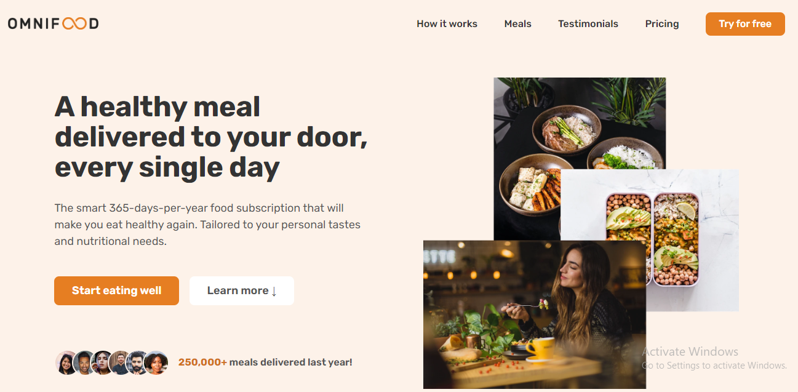

# OmnifoodLandingPage

Omnifood is an AI-powered food subscription that will make you eat healthy again, 365 days per year.

## Table of contents

- [Acknowledgements](#acknowledgements)
- [Features](#features)
- [Built with](#built-with)
- [Demo](#demo)
- [Screenshot](#screenshot)
- [Useful resources](#useful-resources)
- [Run Locally](#run-locally)

## Acknowledgements

- [Jonas Schmedtmann](https://x.com/jonasschmedtman)

## Features

- Live previews
- Fullscreen mode
- Web responsive

## Built with

- Semantic HTML5 markup
- CSS custom properties
- Flexbox
- CSS Grid
- Desktop-first workflow

## Demo

Link to demo:

- Live Site URL: [Live site](https://omnifoodbyuceeey.netlify.app/)

## Screenshots



## Useful resources

- [Google Fonts](https://fonts.google.com/)
- [Mozilla Developer Network](https://developer.mozilla.org/en-US/)
- [Coolors](https://coolors.co/contrast-checker/eeeeee-fdf2e9)
- [Ionicons](https://ionic.io/ionicons)
- [Can-I-Use](https://caniuse.com/)
- [Squoosh](https://squoosh.app/)
- [Open Color](https://yeun.github.io/open-color/)
- [Heroicons](https://heroicons.com/)
- [Tint and Shade Generator](https://maketintsandshades.com/)

## Run Locally

Clone the project

```bash
  git clone https://github.com/UchechiNmecha/OmnifoodLandingPage.git
```

Go to the project directory

```bash
  cd OmnifoodLandingPage
```

Live Server Installation

```bash
  npm install -g live-server
```

Start the server

```bash
  live-server
```
